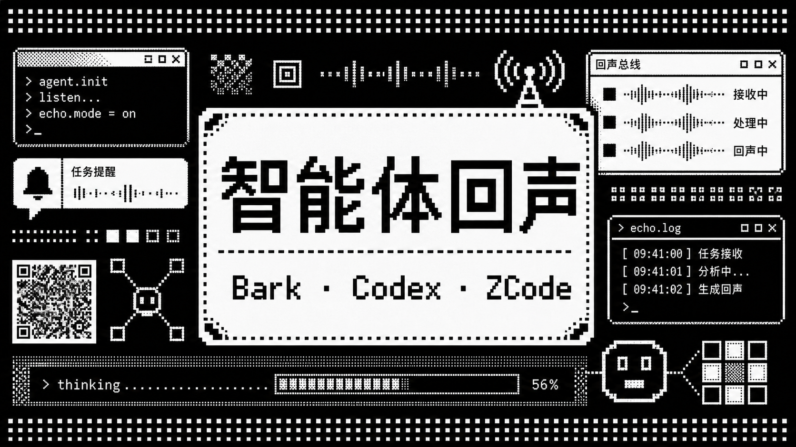
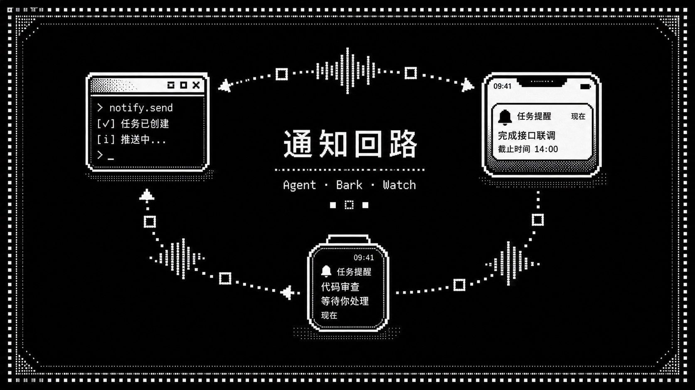

# 智能体回声





这是一个面向 AI 编程助手的本地任务提醒器。它会在本机持续监听已支持工具的日志或会话文件，当 AI 任务完成、停止、需要人工处理或异常中断时，通过 Bark 推送到你的随身设备。

项目当前优先服务内部同事使用：先让大家在自己的 macOS、Ubuntu、Windows 工作环境里稳定收到提醒；如果某个同事使用的工具还没适配，可以按本文档添加 watcher 后直接提交到主分支。

## 已支持能力

- **通知通道**：Bark 是主线能力。iPhone / Apple Watch 是已验证路径；Android 手机、手环等设备取决于 Bark 兼容客户端和系统通知同步能力。
- **已适配工具**：Codex App / Codex CLI、ZCode。
- **分组和图标**：Codex、ZCode 使用不同 Bark `group` 和 `icon`，手机通知列表里能分开看。
- **三端安装**：macOS LaunchAgent、Ubuntu systemd user service、Windows Task Scheduler。
- **诊断命令**：`--doctor` 检查配置、日志目录、状态文件、后台服务和隐私设置。
- **测试命令**：`--test` 发送 Codex 测试通知，`--test-zcode` 发送 ZCode 测试通知。
- **隐私开关**：可以关闭工作目录和消息摘要，避免把敏感内容推送到手机。
- **历史抑制**：首次启动会建立基线，默认不会把旧日志里的历史任务重新推送一遍。

代码里仍保留了通用 webhook、企业微信 webhook、命令行回调等预留入口，但当前推荐路径是 Bark。飞书、个人微信、企业定制 IM 需要确认公司环境后再决定是否启用。

## 适用场景

这个工具适合下面这种工作流：

1. 在电脑上让 Codex、ZCode 或其他 AI 编程助手跑长任务。
2. 人离开电脑，或切换去做别的事。
3. AI 任务完成、卡住或需要确认时，手机、手表或其他 Bark 客户端设备收到提醒。
4. 回到对应电脑继续处理。

它不是云端服务，不需要把代码上传到第三方。监听和判断都发生在你自己的电脑上。

## 随身设备准备

1. 在要接收通知的设备上安装 Bark 或 Bark 兼容客户端。
2. 打开客户端，允许通知权限。
3. 复制客户端显示的 Bark 推送地址或 key。
4. 如果使用 Apple Watch，保持 iPhone 和 Apple Watch 的系统通知同步设置正常。Bark 通知会按 iOS / watchOS 的规则转发到手表。
5. 如果使用 Android 手机、手环或其他穿戴设备，确认对应客户端能接收 Bark API 推送，并确认系统通知能同步到穿戴设备。

配置时可以二选一：

```bash
BARK_URL=https://api.day.app/<your-key>
# 或
BARK_KEY=<your-key>
```

不要把真实的 Bark URL、key、webhook 地址提交到 GitHub。它们属于个人密钥。

## 新电脑安装

从 GitHub Release 下载与你系统对应的包：

- macOS：`codex-watch-notifier-macos-<version>.zip`
- Ubuntu：`codex-watch-notifier-ubuntu-<version>.tar.gz`
- Windows：`codex-watch-notifier-windows-<version>.zip`

也可以直接 clone 仓库后在仓库根目录执行下面的命令。

### macOS

```bash
./install_launch_agent.zsh
$EDITOR ~/.codex-watch-notifier/env
./install_launch_agent.zsh
./codex-watch-notifier.zsh --doctor
./codex-watch-notifier.zsh --test
./codex-watch-notifier.zsh --test-zcode
```

第一次执行安装脚本会复制程序和生成配置文件。编辑 `~/.codex-watch-notifier/env` 填入 Bark 配置后，再执行一次安装脚本来重载后台服务。

常用排查：

```bash
tail -f ~/.codex-watch-notifier/codex-watch-notifier.log
launchctl print gui/$(id -u)/com.xutao.codex-watch-notifier
```

### Ubuntu

```bash
chmod +x install_systemd_user.sh uninstall_systemd_user.sh
./install_systemd_user.sh
$EDITOR ~/.codex-watch-notifier/env
./install_systemd_user.sh
python3 ~/.codex-watch-notifier/bin/codex_watch_notifier.py --doctor
python3 ~/.codex-watch-notifier/bin/codex_watch_notifier.py --test
python3 ~/.codex-watch-notifier/bin/codex_watch_notifier.py --test-zcode
```

常用排查：

```bash
systemctl --user status codex-watch-notifier
journalctl --user -u codex-watch-notifier -f
```

如果机器需要在没有桌面登录会话时继续运行，可以让管理员或本人启用 lingering：

```bash
loginctl enable-linger "$USER"
```

### Windows

在解压后的包目录里打开 PowerShell：

```powershell
.\install_task_scheduler.ps1
notepad $env:USERPROFILE\.codex-watch-notifier\env
.\install_task_scheduler.ps1
py -3 $env:USERPROFILE\.codex-watch-notifier\bin\codex_watch_notifier.py --doctor
py -3 $env:USERPROFILE\.codex-watch-notifier\bin\codex_watch_notifier.py --test
py -3 $env:USERPROFILE\.codex-watch-notifier\bin\codex_watch_notifier.py --test-zcode
```

常用排查：

```powershell
Get-ScheduledTask -TaskName CodexWatchNotifier
Get-Content $env:USERPROFILE\.codex-watch-notifier\codex-watch-notifier.log -Wait
```

Windows 路径可以写在 env 文件里，例如：

```text
CODEX_WATCH_STATE=C:\Users\<name>\.codex-watch-notifier\state.json
```

## 配置说明

配置文件默认位于：

```text
~/.codex-watch-notifier/env
```

常用配置：

| 变量 | 说明 |
| --- | --- |
| `BARK_URL` | Bark 完整推送地址，例如 `https://api.day.app/<key>` |
| `BARK_KEY` | Bark key；和 `BARK_URL` 二选一 |
| `BARK_LEVEL` | Bark 通知级别，默认 `timeSensitive` |
| `CODEX_BARK_GROUP` | Codex 通知分组，默认 `Codex` |
| `CODEX_BARK_ICON` | Codex 通知图标 URL |
| `ZCODE_BARK_GROUP` | ZCode 通知分组，默认 `ZCode` |
| `ZCODE_BARK_ICON` | ZCode 通知图标 URL |
| `CODEX_WATCH_POLL_INTERVAL` | 轮询间隔，默认 2 秒 |
| `ZCODE_WATCH_ENABLED` | 是否启用 ZCode，默认 `1` |
| `ZCODE_WATCH_LOG_ROOT` | ZCode 日志目录，默认 `~/.zcode/cli/log` |
| `NOTIFY_INCLUDE_WORKSPACE` | 是否在通知里显示工作目录，默认 `1` |
| `NOTIFY_INCLUDE_MESSAGE` | 是否在通知里显示消息摘要，默认 `1` |
| `NOTIFY_BODY_MAX_CHARS` | 通知正文最大长度，默认 `1100` |

隐私更严格时可以这样设置：

```bash
NOTIFY_INCLUDE_WORKSPACE=0
NOTIFY_INCLUDE_MESSAGE=0
NOTIFY_BODY_MAX_CHARS=0
```

## 工作原理

程序主体是 `codex_watch_notifier.py`。

- Codex watcher 监听 `~/.codex/sessions` 下的 `rollout-*.jsonl`。
- ZCode watcher 监听 `~/.zcode/cli/log` 下的 `zcode-*.jsonl`。
- watcher 会记录每个文件已经处理到的位置，状态存在 `~/.codex-watch-notifier/state.json`。
- 第一次启动默认只建立基线，不回放旧历史。
- 检测到完成、停止、等待人工或异常事件后，会组装统一通知，再交给 Bark 发送层。

如果你要让 AI 帮你维护这个项目，可以直接把本节和下一节给它看。核心约束是：不要提交个人密钥，不要默认回放旧历史，不要绕过现有 Bark 发送层。

## 添加新的 AI 工具支持

当同事使用 Claude Code CLI、Codex CLI 的新日志格式、Trae、Cursor、VS Code Claude Code 插件或其他工具时，优先按 watcher 的方式接入。

### 先确认工具能不能被监听

先找这个工具在本机留下的稳定痕迹：

- 日志目录：例如 `~/.xxx/log`、`~/.config/<tool>`、工作区内 `.tool/`。
- 会话文件：JSONL、JSON、SQLite、纯文本日志都可以。
- 事件语义：任务完成、等待输入、失败、中断、取消。
- 工作区信息：能否拿到项目路径或会话标题。
- 稳定 ID：能否构造一个不会重复推送的事件 ID。

如果工具没有本地日志，可以考虑命令行 wrapper、shell hook、插件事件、扩展 API，但先不要引入复杂后台服务。

### 代码修改建议

优先只改这些位置：

- `codex_watch_notifier.py`：新增 watcher、解析函数、通知事件构造。
- `env.example`：新增该工具的开关、日志路径、Bark 分组和图标配置。
- `README.md`：补充用户安装和测试说明。
- `assets/`：新增该工具的图标，使用 raw GitHub URL 填入 env。
- `build_packages.zsh`：如果新增文件需要进入发布包，把它加入 `COMMON`。

推荐实现步骤：

1. 为新工具增加默认日志目录和 env 变量，例如 `CLAUDE_WATCH_ENABLED`、`CLAUDE_WATCH_LOG_ROOT`。
2. 写一个只负责发现文件的函数，不在里面解析业务事件。
3. 写一个解析单行或单条记录的函数，把工具私有格式转换成统一事件。
4. 复用现有 state 机制，只处理文件新增内容。
5. 为通知设置独立 `bark_group` 和 `bark_icon`。
6. 给 CLI 增加测试参数，例如 `--test-claude`。
7. 扩展 `--doctor`，让它能检查新工具的日志目录和开关状态。
8. 更新 README，让同事知道如何启用、测试和关闭。

### 需要保持的行为

- 首次运行不推送旧历史。
- 只推送明确的完成、失败、等待人工或中断事件。
- 不把 API key、Bark key、公司内部 token 写进仓库。
- 通知正文必须受 `NOTIFY_INCLUDE_WORKSPACE`、`NOTIFY_INCLUDE_MESSAGE`、`NOTIFY_BODY_MAX_CHARS` 控制。
- 新工具默认不要破坏 Codex 和 ZCode 已有行为。
- Windows、Ubuntu、macOS 至少要能优雅地跳过不存在的日志目录。

### 提交前检查

```bash
python3 -m py_compile codex_watch_notifier.py
python3 codex_watch_notifier.py --doctor
python3 codex_watch_notifier.py --test
python3 codex_watch_notifier.py --test-zcode
./build_packages.zsh internal-test
```

如果你新增了某个工具的测试命令，也要一并运行。

## 协作约定

内部使用阶段可以直接提交到主分支，但提交前请遵守：

- 小步提交，一次只适配一个工具或修一个明确问题。
- 提交信息说明用户可见变化，例如 `Add Claude Code CLI watcher`。
- 不提交 `~/.codex-watch-notifier/env`、个人 token、真实 Bark URL、公司内部 webhook。
- 修改三端安装脚本时，至少说明自己在哪个系统上验证过。
- 如果不确定日志格式是否稳定，在 README 里把该 watcher 标成实验支持。

适合 AI 继续开发的任务描述模板：

```text
请在这个仓库里为 <工具名> 添加 Bark 任务提醒支持。
已知日志位置是 <路径>，完成事件长这样：<样例>。
要求复用 codex_watch_notifier.py 的状态和 Bark 发送层，不提交密钥。
请更新 env.example、README.md，并运行 py_compile 和 build_packages.zsh。
```

## 构建发布包

在 macOS 仓库根目录执行：

```bash
./build_packages.zsh v0.1.0-internal
```

产物会输出到 `dist/`：

- `codex-watch-notifier-macos-v0.1.0-internal.zip`
- `codex-watch-notifier-ubuntu-v0.1.0-internal.tar.gz`
- `codex-watch-notifier-windows-v0.1.0-internal.zip`

每次发布建议从同一个 git commit 构建三端包。

## 卸载

macOS：

```bash
./uninstall_launch_agent.zsh
```

Ubuntu：

```bash
./uninstall_systemd_user.sh
```

Windows：

```powershell
.\uninstall_task_scheduler.ps1
```

卸载脚本只处理后台服务和安装文件。个人 env、日志和 state 是否删除，请根据实际情况手动确认。

## 当前边界

- Bark 是唯一推荐的稳定通知主线。
- 飞书、个人微信、企业微信等还没有作为正式主线启用。
- Claude Code CLI、Trae、Cursor、VS Code Claude Code 插件等还需要同事提供本机日志样例后再适配。
- 这个工具只做本机监听和推送，不负责启动、控制或接管 AI 编程助手。
