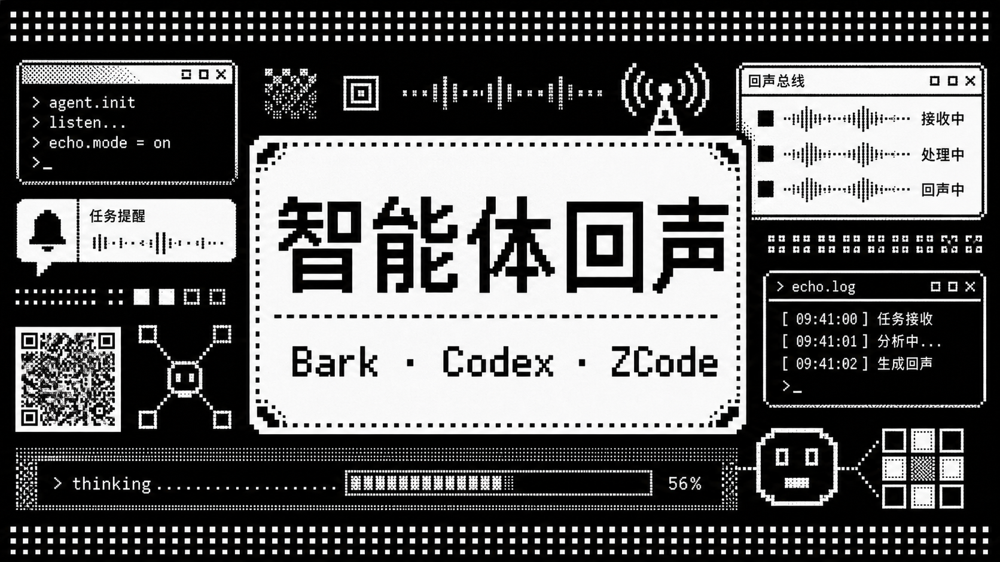
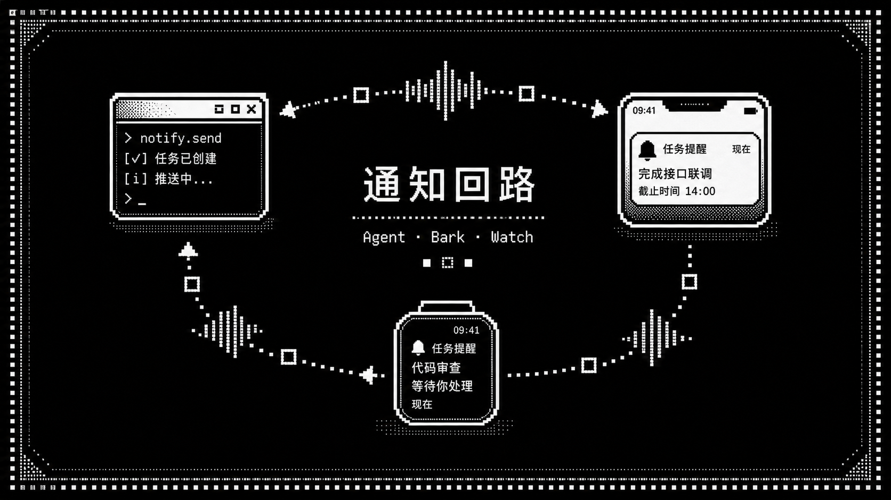

# 智能体回声





夜深以后，终端仍亮着微弱的光。智能体在日志的缝隙里跋涉，把一个个未竟的任务推向完成；人可以暂时离席，去喝水、散步、睡一小会儿，不必守在光标旁等待最后一行回声。

于是这枚小小的信标被放进工作流：它不替你写代码，也不替你判断世界，只在该回来的时候轻轻敲一下随身的屏幕。电脑、手机、手表之间，形成一条安静的回路；任务落定，回声抵达。

```text
终端夜雨响微声
智能孤灯守远程
一缕回波穿腕上
醒来代码已新晴
```

这是一个面向 AI 编程助手的本地任务提醒器。它会在本机持续监听已支持工具的日志或会话文件，当 AI 任务完成、停止、需要人工处理或异常中断时，通过 Bark 或自研 Android 客户端 AgentWatch 推送到你的随身设备。

项目当前优先服务内部同事使用：先让大家在自己的 macOS、Ubuntu、Windows 工作环境里稳定收到提醒；如果某个同事使用的工具还没适配，可以按本文档添加 watcher 后直接提交到主分支。

## 已支持能力

- **通知通道**：iPhone / Apple Watch 可使用个人 Bark；Android 使用项目自研 AgentWatch，通过账号隔离的自建 WebSocket 实时接收。
- **Android 一次登录**：服务器地址、topic 和连接方式已内置，用户只需用邀请代码注册一次，后续自动连接。
- **Android 来源分组**：Codex、ZCode、Kimi Code、Grok Build、Claude Code 使用独立通知频道和定制图标，手机系统可分别管理，App 历史页也按来源分类。
- **已适配工具**：Codex App / Codex CLI、ZCode、Kimi Code、Grok Build、Claude Code。
- **主任务优先**：Codex、Kimi Code 和 Grok Build 默认过滤子智能体或子会话事件；Claude Code 只接入主线程 `Stop` / `StopFailure`，不配置 `SubagentStop`。
- **Claude 官方 hooks**：支持 Claude Code `2.1.196+`。安装和更新会幂等合并用户 settings 中的 `Stop`、`StopFailure` hooks，保留用户已有 hooks；不会启用 `SubagentStop`。hook 只写入本地队列，网络投递由后台 watcher 完成。
- **AgentWatch 账号独享通道**：采用 Android 通道的电脑登录后只得到当前账号的 computer token；发布 API 从 token 推导目标，电脑不能指定 topic 或其他用户。Bark-only 不需要这次登录。
- **三种桌面投递模式**：`bark` 面向 iPhone / Apple Watch，`agentwatch` 面向 Android，`both` 让两条通道独立共存。
- **三端安装**：macOS LaunchAgent、Ubuntu systemd user service、Windows Task Scheduler。
- **统一 CLI**：macOS、Ubuntu、Windows 都提供 `install/login/status/doctor/update/logout/uninstall` 和 `--json`；安装入口使用 `install --delivery bark|agentwatch|both`。
- **测试命令**：`--test`、`--test-zcode`、`--test-kimi`、`--test-grok`、`--test-claude` 分别显式测试五种工具的通知；每条命令只发送一次。
- **隐私开关**：可以关闭工作目录和消息摘要，避免把敏感内容推送到手机。
- **历史抑制**：首次启动会建立基线，默认不会把旧日志里的历史任务重新推送一遍。

代码里仍保留了通用 webhook、企业微信 webhook、命令行回调等预留入口；当前推荐路径是 iOS 使用 Bark、Android 使用 AgentWatch。飞书、个人微信、企业定制 IM 需要确认公司环境后再决定是否启用。

## 适用场景

这个工具适合下面这种工作流：

1. 在电脑上让 Codex、ZCode、Kimi Code、Grok Build、Claude Code 或其他 AI 编程助手跑长任务。
2. 人离开电脑，或切换去做别的事。
3. AI 任务完成、卡住或需要确认时，手机、手表或其他通知客户端设备收到提醒。
4. 回到对应电脑继续处理。

任务监听和判断都发生在你自己的电脑上，不需要上传代码。通知正文只经过你选择的个人 Bark 通道或项目自建中继：Bark 模式使用用户自己的 Bark 地址，AgentWatch 模式才通过账号绑定的 `/publish` 接口发送；电脑无法读取手机消息，也无法选择其他 AgentWatch 用户的通道。

## 先选择接收设备和桌面投递模式

桌面端有三种相互独立的投递选择。安装前，人工用户应先确认自己的接收设备；由 AI 安装时，AI 必须先询问，或根据用户已经明确提供的设备信息作出判断，不能默认要求所有人注册 AgentWatch。

| 模式 | 接收设备 | 手机端准备 | 电脑端凭据 |
| --- | --- | --- | --- |
| `bark` | iPhone / Apple Watch | 只安装 Bark；不安装、不注册、不登录 AgentWatch | 安全保存 Bark 首页的个人推送地址或 key |
| `agentwatch` | Android / Android 穿戴设备转发 | 安装自研 AgentWatch App，并注册或登录账号 | 使用同一 AgentWatch 账号登录，保存只写 computer token |
| `both` | 同时使用上述两类设备 | 分别完成 Bark 和 Android AgentWatch 准备 | 两条通道独立配置；即使尚未完成 Android 账号登录，已配置的 Bark 仍应照常运行 |

CLI 使用以下明确的安装契约：

```text
agentwatch install --delivery bark
agentwatch install --delivery agentwatch
agentwatch install --delivery both
```

这是投递模式选择，不是测试命令。`install`、`update` 和 `doctor` 都不得自动发送测试通知。`doctor` 只诊断，不会替用户启动或重启后台服务。不要编造或依赖 `configure-bark` 命令；Bark 个人地址应由用户本人安全写入电脑的私有配置或安全输入流程。

## 随身设备准备

### iPhone / Apple Watch：Bark

1. 在 iPhone 安装 Bark。
2. 打开 Bark，允许通知权限。
3. 复制 Bark 首页显示的推送地址或 key。
4. 如果使用 Apple Watch，保持 iPhone 和 Apple Watch 的系统通知同步设置正常。Bark 通知会按 iOS / watchOS 的规则转发到手表。

iPhone / Apple Watch 用户只需要 Bark，不需要安装 AgentWatch App，也不需要注册或登录 AgentWatch 账号。电脑仍然必须得到这台 iPhone 的 Bark 首页个人推送地址或 key 才能发送通知；这是把个人 Bark 凭据安全配置到电脑，不是与 AgentWatch 账号配对。

配置时可以二选一：

```bash
BARK_URL=https://api.day.app/<your-key>
# 或
BARK_KEY=<your-key>
```

Bark 完整推送地址本身包含 key，同样属于密钥。不要把真实值发到 AI 对话、写进命令行参数、日志或 Git；由用户本人写入权限受限的 `~/.codex-watch-notifier/env`，AI 只能准备空白配置和检查文件权限，不能读取或回显该值。临时在当前 shell 中 `export BARK_URL=...` 或 `export BARK_KEY=...` 不算后台配置，后台 watcher 只读取持久的私有 `env` 文件。用户保存文件后必须运行 `~/.local/bin/agentwatch update`，让 CLI 重新协调并启动或重启后台服务，然后再运行 `doctor --json`。AgentWatch 密码同样不得进入 AI 对话或 argv，只能由用户在 CLI 隐藏提示中输入。

### Android / 手环：AgentWatch

1. 安装 GitHub Release 中的 `AgentWatch-android-<version>.apk`，打开后允许通知。
2. 新用户输入管理员私下提供的邀请代码、账号和至少 12 位密码完成注册；已有账号直接登录。服务器和连接方式已内置，不需要手工添加订阅。
3. 确认首页显示“已连接”，再按页面按钮把自启动和耗电管理设为“完全允许后台行为”。这些 Android 系统确认必须由用户亲自完成。
4. 如果需要手环或手表震动，在手机的穿戴设备 App 中允许转发 AgentWatch 通知；手环本身不需要安装 AgentWatch。
5. 电脑安装后使用相同账号登录。服务器给每台电脑签发独立、只写的 computer token，并从 token 推导该账号的私有 topic；其他账号没有读取权限。

服务器只短期缓存通知用于手机离线补发，不建立长期正文历史。手机收到后由 AgentWatch 保存在 App 私有数据库中。系统通知被清除后，仍可在 App 的消息页面按 Codex、ZCode、Kimi、Grok、Claude 等来源查看。

API 地址是公开元数据，会直接保存在仓库中；账号密码、computer token、App token、邀请码和服务端认证数据库仍然是密钥，绝不能提交到 GitHub。电脑端不再填写 ntfy topic 或 publisher token。

AgentWatch 的 Android 源码、构建和签名说明见 [`android/README.md`](android/README.md)，注册服务部署说明见 [`deploy/agentwatch-registration/README.md`](deploy/agentwatch-registration/README.md)。旧电脑升级后即使 env 仍保留 `NTFY_URL/NTFY_TOKEN`，v0.3.0 也会明确忽略它们，绝不会同时向旧共享 topic 双发。

不要把真实的 Bark URL、Bark key、computer token、账号密码或 webhook 地址提交到 GitHub。它们属于个人密钥。

## 新电脑安装

从 GitHub Release 下载与你系统对应的包：

- macOS：`codex-watch-notifier-macos-<version>.zip`
- Ubuntu：`codex-watch-notifier-ubuntu-<version>.tar.gz`
- Windows：`codex-watch-notifier-windows-<version>.zip`

也可以直接 clone 仓库后在仓库根目录执行下面的命令。

先按接收设备选择 `bark`、`agentwatch` 或 `both`。`bark` 不会要求 AgentWatch 账号；`agentwatch` 才需要用户本人输入账号和隐藏密码；`both` 中两条通道互不阻塞。AgentWatch 密码只用于一次 HTTPS 登录，不会保存，登录成功后只保存当前电脑的 computer token。任何模式的安装、`update` 和 `doctor` 都不会自动发送测试通知。安装和 `update` 还会幂等协调 Claude Code hooks，不覆盖已有配置，也不因此触发通知。

### macOS

```bash
./install_launch_agent.zsh --delivery bark
# 或 --delivery agentwatch / --delivery both
# bark/both：用户私下写好 ~/.codex-watch-notifier/env 后执行
~/.local/bin/agentwatch update
~/.local/bin/agentwatch doctor --json
```

常用排查：

```bash
tail -f ~/.codex-watch-notifier/codex-watch-notifier.log
launchctl print gui/$(id -u)/com.xutao.codex-watch-notifier
```

### Ubuntu

```bash
chmod +x install_systemd_user.sh uninstall_systemd_user.sh
./install_systemd_user.sh --delivery bark
# 或 --delivery agentwatch / --delivery both
# bark/both：用户私下写好 ~/.codex-watch-notifier/env 后执行
~/.local/bin/agentwatch update
~/.local/bin/agentwatch doctor --json
```

常用排查：

```bash
systemctl --user status codex-watch-notifier
journalctl --user -u codex-watch-notifier -f
```

如果机器需要在没有桌面登录会话时继续运行，可以让管理员或本人启用 lingering：

```bash
loginctl enable-linger "$USER"
```

### Windows

在解压后的包目录里打开 PowerShell：

```powershell
.\install_task_scheduler.ps1 --delivery bark
# 或 --delivery agentwatch / --delivery both
# bark/both：用户私下写好持久 env 后执行
& "$env:USERPROFILE\.local\bin\agentwatch.cmd" update
& "$env:USERPROFILE\.local\bin\agentwatch.cmd" doctor --json
```

常用排查：

```powershell
Get-ScheduledTask -TaskName CodexWatchNotifier
Get-Content $env:USERPROFILE\.codex-watch-notifier\codex-watch-notifier.log -Wait
```

任务计划程序显示 `Ready` 只代表任务已注册、正在等待触发，不代表 watcher 当前正在运行。应以 `agentwatch doctor --json` 的 `checks.service_running` 和运行日志为准；`doctor` 本身不会启动任务或发送测试。

Windows 路径可以写在 env 文件里，例如：

```text
CODEX_WATCH_STATE=C:\Users\<name>\.codex-watch-notifier\state.json
```

### 让 AI 安装

AI 必须先询问或判断接收设备，再映射到 `agentwatch install --delivery bark|agentwatch|both`。安装器采用非交互方式完成不含密钥的文件和服务安装，例如：

```bash
./install_launch_agent.zsh --delivery both --json --no-login
```

`agentwatch` 或 `both` 模式看到 `login_required=true` 后，AI 应暂停，让用户亲自在终端运行 `~/.local/bin/agentwatch login` 并输入隐藏密码。`bark` 模式不得要求 AgentWatch 登录；AI 应让用户本人把 Bark 首页个人推送地址或 key 写入电脑持久私有配置，且不得通过聊天或 argv 传递。临时 shell `export` 不算后台配置。用户只需确认 secret 已经保存，不应把值反馈给 AI；随后由 AI 运行 `~/.local/bin/agentwatch update` 重新协调后台，再运行只读的 `agentwatch doctor --json`。`both` 尚未完成 Android 登录时，update 仍应让 Bark 独立运行。`doctor` 不会启动服务或自动测试通知。完整约束见 [`AI_INSTALL.md`](AI_INSTALL.md)。

统一命令：

```text
agentwatch install --delivery bark|agentwatch|both
agentwatch login
agentwatch status
agentwatch doctor
agentwatch update
agentwatch logout
agentwatch uninstall
```

## 配置说明

配置文件默认位于：

```text
~/.codex-watch-notifier/env
```

常用配置：

| 变量 | 说明 |
| --- | --- |
| `BARK_URL` | Bark 完整推送地址，例如 `https://api.day.app/<key>` |
| `BARK_KEY` | Bark key；和 `BARK_URL` 二选一 |
| `BARK_LEVEL` | Bark 通知级别，默认 `timeSensitive` |
| `CODEX_BARK_GROUP` | Codex 通知分组，默认 `Codex` |
| `CODEX_BARK_ICON` | Codex 通知图标 URL |
| `ZCODE_BARK_GROUP` | ZCode 通知分组，默认 `ZCode` |
| `ZCODE_BARK_ICON` | ZCode 通知图标 URL |
| `KIMI_BARK_GROUP` | Kimi Code 通知分组，默认 `Kimi Code` |
| `KIMI_BARK_ICON` | Kimi Code 通知图标 URL；默认使用仓库内的 Kimi 官方 App 图案适配版 |
| `GROK_BARK_GROUP` | Grok Build 通知分组，默认 `Grok Build` |
| `GROK_BARK_ICON` | Grok Build 通知图标 URL；默认使用仓库内的 Grok 官方 App 图案适配版 |
| `CLAUDE_BARK_GROUP` | Claude Code 通知分组，默认 `Claude Code` |
| `CLAUDE_BARK_ICON` | Claude Code 的可选 Bark 图标 URL；可使用仓库内的 [`source_claude.png`](https://raw.githubusercontent.com/taotaoxu7447/bark_notification/main/android/app/src/main/res/drawable-nodpi/source_claude.png)，发布包同时包含 `assets/claude-icon-v1.png` |
| `AGENTWATCH_API_BASE` | 账号绑定 API，默认是项目自建服务器的 `/agentwatch/api/v1` |
| `AGENTWATCH_PRIORITY` | AgentWatch 通知优先级，默认 `default` |
| `CODEX_WATCH_POLL_INTERVAL` | 轮询间隔，默认 2 秒 |
| `NOTIFY_DELIVERY_MAX_ATTEMPTS` | 同一事件的自动投递总次数，默认且硬上限为 `2`；设为 `1` 可关闭自动补投 |
| `NOTIFY_DELIVERY_RETRY_DELAY_SECONDS` | 第二次投递前的等待时间，默认 `60` 秒、最低 `30` 秒 |
| `CODEX_WATCH_NOTIFY_SUBAGENTS` | 是否提醒 Codex 子智能体事件，默认 `0`，只提醒主会话 |
| `ZCODE_WATCH_ENABLED` | 是否启用 ZCode，默认 `1` |
| `ZCODE_WATCH_LOG_ROOT` | ZCode 日志目录，默认 `~/.zcode/cli/log` |
| `KIMI_WATCH_ENABLED` | 是否启用 Kimi Code，默认 `1` |
| `KIMI_WATCH_SESSIONS_ROOT` | Kimi Code 会话目录，默认 `~/.kimi-code/sessions` |
| `KIMI_WATCH_NOTIFY_SUBAGENTS` | 是否提醒 Kimi 子智能体，默认 `0` |
| `GROK_WATCH_ENABLED` | 是否启用 Grok Build，默认 `1` |
| `GROK_WATCH_SESSIONS_ROOT` | Grok Build 会话目录，默认 `~/.grok/sessions` |
| `GROK_WATCH_NOTIFY_SUBAGENTS` | 是否提醒 Grok 子会话，默认 `0` |
| `CLAUDE_WATCH_ENABLED` | 是否启用 Claude Code 官方 hook 队列监听，默认 `1` |
| `CLAUDE_WATCH_EVENTS_FILE` | Claude hook 本地队列，默认 `~/.codex-watch-notifier/claude-hook-events.jsonl`；自定义路径必须是 AgentWatch 注册的专用文件，且文件、父目录均为当前用户私有，不能复用其他数据文件 |
| `CLAUDE_WATCH_STOP_SETTLE_SECONDS` | Claude 首次 `Stop` 的暂定等待窗口，默认 `10` 秒，配置范围 `5`–`600` 秒；窗口内不投递、不计重试、不前移队列 offset |
| `CLAUDE_WATCH_SPOOL_MAX_BYTES` | Claude 队列已消费数据的容量软上限，默认 `4194304`（4 MiB），最低 `65536`；未读或待补投数据不会被截断 |
| `CLAUDE_WATCH_SPOOL_MAX_AGE_SECONDS` | Claude live 队列已消费数据的保留时间，默认 `86400`（24 小时），最低 `3600`；到期后仅在安全条件满足时轮转 |
| `NOTIFY_INCLUDE_WORKSPACE` | 是否在通知里显示工作目录，默认 `1` |
| `NOTIFY_INCLUDE_MESSAGE` | 是否在通知里显示消息摘要，默认 `1` |
| `NOTIFY_BODY_MAX_CHARS` | 通知正文最大长度，默认 `1100` |

隐私更严格时可以这样设置：

```bash
NOTIFY_INCLUDE_WORKSPACE=0
NOTIFY_INCLUDE_MESSAGE=0
NOTIFY_BODY_MAX_CHARS=0
```

## 工作原理

程序主体是 `codex_watch_notifier.py`。

- Codex watcher 监听 `~/.codex/sessions` 下的 `rollout-*.jsonl`。
- ZCode watcher 监听 `~/.zcode/cli/log` 下的 `zcode-*.jsonl`。
- Kimi Code watcher 监听 `~/.kimi-code/sessions` 下主智能体的 `agents/main/wire.jsonl`，只在 `step.end` 且 `finishReason=end_turn` 时提醒，不把工具调用步骤当成完成。
- Grok Build watcher 监听 `~/.grok/sessions` 下的 `events.jsonl`，识别 `turn_ended` 的 `completed`、`error` 和 `cancelled` 结果。
- Claude Code 使用官方 `Stop` 和 `StopFailure` hooks。hook 接收 Claude 提供的 stdin JSON，校验后只追加到权限受限的本地 JSONL 队列并立即退出，不在 Claude 进程中访问网络；后台 watcher 再读取队列并投递。项目不会配置 `SubagentStop`。
- Claude 会并行执行同一事件的所有匹配 hooks；因此 `stop_hook_active=false` 只表示第一次 `Stop`，不能证明其他 project/plugin/session/managed Hook 最终没有阻止停止。watcher 默认把它作为暂定记录保留 10 秒，期间不前移队列 offset、不调用网络通道，也不消耗两轮投递额度；每轮只读扫描后续完整队列记录。若出现同一 `session_id`、`prompt_id` 和 transcript 的有效 `stop_hook_active=true`，或同轮有效 `StopFailure`，就丢弃旧的暂定记录并处理后面的终态；`true` 和独立 `StopFailure` 不再等待。Claude 官方说明 transcript 是异步写入的，所以 `transcript_size` 增长只能作为旁证，绝不会单独触发丢弃；通知正文始终使用官方 `last_assistant_message`。
- 10 秒默认值优先保证普通提醒的及时性，但不覆盖官方 prompt Hook 的 30 秒默认超时。如果某个阻断 Hook 在窗口结束后才返回，仍可能先收到一次暂定提醒，这是旁路通知 Hook 无法获知并行结果合并时刻的已知边界。可用 `CLAUDE_WATCH_STOP_SETTLE_SECONDS` 在 5–600 秒内调整；需要降低延迟后误提醒或二次提醒的概率时可设为 `35` 或更长，最严格可设为 `600`，代价是普通提醒也会等同样久；自定义超时超过 600 秒仍超出本机制保证范围。
- Claude live 队列中已经消费的数据默认在达到 4 MiB 或保留 24 小时后轮转，以先达到者为准。4 MiB 是容量软上限：只要还有未读记录、待补投事件或现存安全 drain，watcher 就不会截断或删除这些数据。轮转使用 rename 后继续排空旧 inode，确认读取完成并经过 30 秒并发写入安全窗后才删除 drain，因此不会为了隐私清理而丢事件或重发历史。
- Claude Code 最低版本为 `2.1.196`：exec-form `args` 从 `2.1.139` 可用，`background_tasks` / `session_crons` 从 `2.1.145` 可用，而作为同一用户 prompt 主去重键的 `prompt_id` 需要 `2.1.196`。`status` / `doctor` 会解析 `claude --version`；检测到更旧或无法识别的版本时不会把 Hook 报告为可用。字段与并行语义以 [Claude Code 官方 Hooks 参考](https://code.claude.com/docs/en/hooks) 和 [官方 changelog](https://github.com/anthropics/claude-code/blob/main/CHANGELOG.md) 为准。
- 安装器会记录 Hook 实际写入的 Claude user-settings 路径。若 `CLAUDE_CONFIG_DIR` 改变，`status` 会要求运行 `agentwatch update`，更新时先清理旧位置再写入新位置，避免两个 `Stop` Hook 同时触发。
- `doctor` 能检查 user settings、系统 `managed-settings.json` 和按文件名顺序合并的 `managed-settings.d/*.json`，但静态检查无法完整覆盖 project、local、plugin、skill、agent、session、远程 managed policy 等运行时来源。最终必须在 Claude Code 内同时查看 `/status` 的 `Setting sources` 和 `/hooks` 的实际 Hook 列表；因此 CLI 诊断文案只表示“未检测到已知文件策略阻止”，不宣称覆盖所有生效 scope。
- `CLAUDE_WATCH_EVENTS_FILE` 留空时使用 AgentWatch 私有配置目录中的默认队列。若必须自定义，它只能指向 AgentWatch 登记的专用队列：不能是符号链接、junction、目录或其他应用的数据文件，文件和父目录必须由当前用户持有并保持私有。安装或更新拒绝接管未登记的现有文件，避免 Hook 追加或轮转时破坏其他数据。
- watcher 会记录每个文件已经处理到的位置，状态存在 `~/.codex-watch-notifier/state.json`。
- watcher 会对状态文件持有系统级单实例锁；旧服务未退出时，新实例会直接退出且不发送，避免两个进程各自重复投递。
- 第一次启动默认只建立基线，不回放旧历史；Claude 队列首次启用时同样基线到当前文件末尾，不补发安装前的旧事件。
- 每个事件最多自动投递两次；第一次仍有外部通道失败时，至少等待 30 秒再补投一次，计数会先写入状态文件，服务重启也不会重置。两轮后仍失败会停止自动发送并在 `--doctor` 中留下记录，避免无限重试造成通知轰炸。
- 多通道首次投递后会持久记录已经成功的通道；第二次只补投失败的通道。macOS 本机横幅不能掩盖 AgentWatch/Bark 远程失败，也不会让已经成功的手机通道再响一次。
- AgentWatch 私有发布会携带稳定 event ID 和来源。服务器从 computer token 推导账号与 topic，电脑请求体不接受 topic/user；Android 即使收到第二次补投或断线重放，也只记录并显示同一事件一次。
- Bark 通知使用事件的稳定 ID；补投时复用同一 Bark `id`，让支持该能力的 Bark 客户端和服务端折叠或更新同一条通知。它是第二层防重复保护，不替代本地状态去重。
- Codex 5.6 创建的子智能体 rollout 默认静默，只提醒主会话最终完成、等待人工或中止；排障时可设置 `CODEX_WATCH_NOTIFY_SUBAGENTS=1` 恢复全部提醒。
- Kimi Code 的非 `main` agent 和带 `parent_session_id` 的 Grok 子会话也默认静默，可分别通过对应的 `*_NOTIFY_SUBAGENTS=1` 临时开启。
- 检测到完成、停止、等待人工或异常事件后，会组装统一通知，再交给个人 Bark 或账号绑定的 AgentWatch 私有发布 API。

如果你要让 AI 帮你维护这个项目，可以直接把本节和下一节给它看。核心约束是：不要提交个人密钥，不要默认回放旧历史，不要绕过 AgentWatch 账号绑定的发布层。

## 添加新的 AI 工具支持

当同事使用 Codex CLI 的新日志格式、Trae、Cursor、VS Code Claude Code 插件或其他尚未适配的工具时，优先按 watcher 或官方 hook 的方式接入。Claude Code CLI 本身已通过官方 hooks 支持。

### 先确认工具能不能被监听

先找这个工具在本机留下的稳定痕迹：

- 日志目录：例如 `~/.xxx/log`、`~/.config/<tool>`、工作区内 `.tool/`。
- 会话文件：JSONL、JSON、SQLite、纯文本日志都可以。
- 事件语义：任务完成、等待输入、失败、中断、取消。
- 工作区信息：能否拿到项目路径或会话标题。
- 稳定 ID：能否构造一个不会重复推送的事件 ID。

如果工具没有本地日志，可以考虑命令行 wrapper、shell hook、插件事件、扩展 API，但先不要引入复杂后台服务。

### 代码修改建议

优先只改这些位置：

- `codex_watch_notifier.py`：新增 watcher、解析函数、通知事件构造。
- `env.example`：新增该工具的开关、日志路径和 Bark 分组、图标配置。
- `README.md`：补充用户安装和测试说明。
- `assets/`：新增该工具的图标，使用 raw GitHub URL 填入 env。
- `build_packages.zsh`：如果新增文件需要进入发布包，把它加入 `COMMON`。

推荐实现步骤：

1. 为新工具增加默认日志目录和 env 变量，例如 `EXAMPLE_WATCH_ENABLED`、`EXAMPLE_WATCH_LOG_ROOT`。
2. 写一个只负责发现文件的函数，不在里面解析业务事件。
3. 写一个解析单行或单条记录的函数，把工具私有格式转换成统一事件。
4. 复用现有 state 机制，只处理文件新增内容。
5. 为通知设置独立来源、`bark_group` 和 `bark_icon`；AgentWatch 的 topic 只能由服务器账号绑定逻辑决定。
6. 给 CLI 增加测试参数，例如 `--test-example`。
7. 扩展 `--doctor`，让它能检查新工具的日志目录和开关状态。
8. 更新 README，让同事知道如何启用、测试和关闭。

### 需要保持的行为

- 首次运行不推送旧历史。
- 只推送明确的完成、失败、等待人工或中断事件。
- 不把 API key、Bark key、computer token、账号密码或公司内部 token 写进仓库；项目正式 API 地址可以公开。
- 通知正文必须受 `NOTIFY_INCLUDE_WORKSPACE`、`NOTIFY_INCLUDE_MESSAGE`、`NOTIFY_BODY_MAX_CHARS` 控制。
- 新工具默认不要破坏 Codex、ZCode、Kimi Code、Grok Build 和 Claude Code 已有行为。
- Windows、Ubuntu、macOS 至少要能优雅地跳过不存在的日志目录。

### 提交前检查

```bash
python3 -m py_compile codex_watch_notifier.py
python3 codex_watch_notifier.py --doctor
./build_packages.zsh internal-test
```

只有用户明确要求某个来源的端到端通知测试时，才从下面选择对应的一条执行一次；不要把整组命令连续执行：

```bash
python3 codex_watch_notifier.py --test
python3 codex_watch_notifier.py --test-zcode
python3 codex_watch_notifier.py --test-kimi
python3 codex_watch_notifier.py --test-grok
python3 codex_watch_notifier.py --test-claude
```

以上 `--test*` 都是真实、显式、单次的通知测试；安装、更新、登录、诊断和构建不得自动调用。如果你新增了某个工具的测试命令，也要把它加入人工验收清单。

## 协作约定

内部使用阶段可以直接提交到主分支，但提交前请遵守：

- 小步提交，一次只适配一个工具或修一个明确问题。
- 提交信息说明用户可见变化，例如 `Add Claude Code CLI watcher`。
- 不提交 `~/.codex-watch-notifier/env`、computer token、真实 Bark URL、账号密码、认证数据库或公司内部 webhook。
- 修改三端安装脚本时，至少说明自己在哪个系统上验证过。
- 如果不确定日志格式是否稳定，在 README 里把该 watcher 标成实验支持。

适合 AI 继续开发的任务描述模板：

```text
请在这个仓库里为 <工具名> 添加 Bark / AgentWatch 任务提醒支持。
已知日志位置是 <路径>，完成事件长这样：<样例>。
要求复用 codex_watch_notifier.py 的状态和账号绑定发送层，不提交密钥。
请更新 env.example、README.md，并运行 py_compile 和 build_packages.zsh。
```

## 构建发布包

在 macOS 仓库根目录执行：

```bash
./build_packages.zsh v0.3.0
```

产物会输出到 `dist/`：

- `codex-watch-notifier-macos-v0.3.0.zip`
- `codex-watch-notifier-ubuntu-v0.3.0.tar.gz`
- `codex-watch-notifier-windows-v0.3.0.zip`

Android 正式 APK 在 `android/` 内使用长期发布密钥单独构建：

```bash
cd android
./build_release.zsh
```

本地产物是 `android/app/build/outputs/apk/release/app-release.apk`，v0.3.0 Release 发布名为 `AgentWatch-android-v0.3.0.apk`。发布密钥和密码绝不能进入 Git；丢失密钥将导致以后无法覆盖升级已安装的 APK。

每次发布建议从同一个 git commit 构建三种电脑端安装包和 Android APK。

## 卸载

macOS：

```bash
./uninstall_launch_agent.zsh
```

Ubuntu：

```bash
./uninstall_systemd_user.sh
```

Windows：

```powershell
.\uninstall_task_scheduler.ps1
```

卸载脚本会处理后台服务和安装文件，并从 Claude user settings 中精确移除 AgentWatch 自己管理的 `Stop`、`StopFailure` hook 条目；用户已有的其他 Claude hooks 和设置必须原样保留。若 settings 已损坏而无法安全清理，卸载会先移除后台服务，但保留 Hook 仍指向的本机运行时并明确返回部分失败；修复 settings 后再次运行卸载即可。个人 env、日志和 state 是否删除，请根据实际情况手动确认。

## 当前边界

- iPhone / Apple Watch 可使用个人 Bark；Android / 手环通知转发推荐 AgentWatch，底层使用项目自建中继。
- AgentWatch 为每个账号分配独立随机 topic 与最小权限 ACL；电脑只能调用账号绑定的私有发布 API。
- 服务器仅做短期离线补发，不作为长期消息历史库；超出缓存期仍未上线的设备无法补回该消息。
- 飞书、个人微信、企业微信等还没有作为正式主线启用。
- Claude Code CLI 已通过官方 `Stop` / `StopFailure` hooks 支持；Trae、Cursor、VS Code Claude Code 插件等仍需要同事提供本机日志或事件样例后再适配。
- 这个工具只做本机监听和推送，不负责启动、控制或接管 AI 编程助手。
